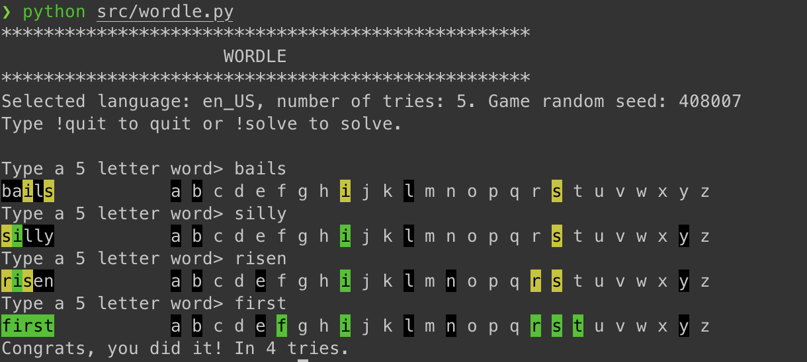
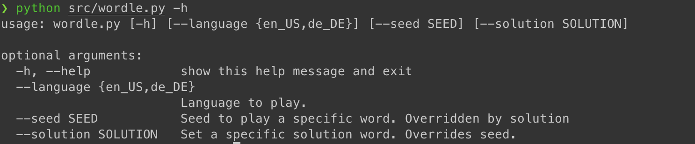

# Wordle on the Commandline

Guess the 5-letter word in five tries. Correct letters are marked yellow, if they are in the right position green. If a letter is on black background, it doesn't occur in the solution at all.

Currently, for English and German language.

